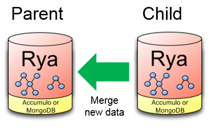
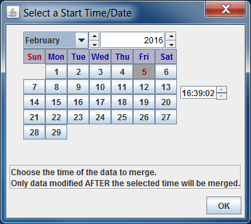

<!-- Licensed to the Apache Software Foundation (ASF) under one
or more contributor license agreements.  See the NOTICE file
distributed with this work for additional information
regarding copyright ownership.  The ASF licenses this file
to you under the Apache License, Version 2.0 (the
"License"); you may not use this file except in compliance
with the License.  You may obtain a copy of the License at

  http://www.apache.org/licenses/LICENSE-2.0

Unless required by applicable law or agreed to in writing,
software distributed under the License is distributed on an
"AS IS" BASIS, WITHOUT WARRANTIES OR CONDITIONS OF ANY
KIND, either express or implied.  See the License for the
specific language governing permissions and limitations
under the License. -->

# Rya Export

___

## Purpose

Rya Export is a java application that can be used to export from a parent Rya datastore to a child Rya datastore. The changes to the child can then be synced back to the parent when the process is run again after the child datastore has collected/modified its data set. The datastores currently supported are Accumulo and MongoDB.



## Overview

At deployment time, a Rya child instance will be created and sent out where its users will create, modify, and delete data. This data from the child will then need to be synced with its parent after deployment. By default, the data only needs to be handled at the datastore level and so will not need to know the logical consistency of the higher level models it's storing (i.e. Rya logic). Some decisions that were made about the tool:

  * When copying, the parent is copying its data to its child and can optionally filter its data to be after a specified timestamp.

  * When merging, the data is going only ONE way: the child is re-integrating its new data with the parent Rya instance (the parent will NOT merge its new data into the child).

  * For Accumulo datastores, since an update to a row value is just a delete followed by an add, row value updates aren't needed.

  * For Accumulo datastores, special care must be taken when there's a difference between the parent's and child's column visibility in the same row. In this case, the two visibility values will be OR'ed together to produce the new visibility value to use.
  
  * MongoDB does not support column visibility.

  * The tool will support merging data from after a specific time (start time). This will merge in a smaller subset of data modifications from the child to the parent.
  
  * The Rya Export Client can handle copying/merging from Accumulo to Accumulo, Accumulo to MongoDB, MongoDB to Accumulo, and MongoDB to MongoDB.

## Rya Export Client Process

The Rya Export Client can be ran through the command line. It can either be used to copy a child instance from a parent or it can be used to sync an already exported child instance by merging its data over to the parent instance. The user can configure a timestamp for the data to be included so only data coming after that time is replicated. The command line will make calls to an uber jar containing the tool and execute the job. This will also allow extra config parameters (such as the location of the parent and child instance) to be used when called.

## Implementation Details

The Rya Export Client can be run on any machine connected to both the parent instance machine and the child instance machine. It determines which machine is the parent and child by storing metadata on the child machine that indicates what the parent machine was during the initial copy.

The Accumulo side export uses a TimestampFilter iterator setting to only include the data that fits the time range. This time criteria is added to the Scanner that fetch the Rya statements to copy. The desired statements are fetched from the parent and then added to the child table using a BatchWriter. The process job also checks a parent's authorization list so they can be copied to the child user.

The MongoDB side export uses a DB object to search the collection for a Rya statement while sorting them by timestamp.

By default the tool will copy all the tables from the parent.

When merging, the Rya Export Client Accumulo statement store utilizes its internal DAO to handle the processing of data. It is implemented using Java with a Scanner running over the child Accumulo instance to find the statements to copy and then queries for the same statements in the parent instance. If the statement key is found then it doesn't need to merge the statement and it proceeds to the next statement. The column visibility is combined with an OR operation if only the visibilities are different between the child and parent.

If a key is found in the parent that doesn't exist in the child instance then we need to determine whether it was added by the parent or deleted by the child. If the timestamp is before the start time then the child deleted the key and the parent should delete the key as well. If the timestamp is after the start time then the parent added it and the key should remain. Similar time comparisons are applied too if a key exists in the child instance but not the parent.

### Merge Logic

**Parent:** Original Rya repository. Ignore modifications.  
**Child:** Rya repository that was copied from parent then modified.  
**older, newer:** Statement timestamp is older/newer than specified merge time (start time).  
**missing:** Statement is absent from the repository.  

| **case** | **Parent** | **Child** | **assume that** | **merge modification** | **in parent after** |
|----------|------------|-----------|-----------------|------------------------|---------------------|
| 1        | older      | missing   | child deleted   | delete from parent     | no                  |
| 2        | newer      | missing   | parent added    | do nothing             | yes                 |
| 3        | missing    | older     | parent deleted  | do nothing             | no                  |
| 4        | missing    | newer     | child added     | add to parent          | yes                 |
| 5x       | older      | older     | same key        | do nothing             | yes                 |
| 6x       | newer      | newer     | same key        | do nothing             | yes                 |
| 7\*      | older      | newer     | child updated   | do cases 1 and 4       | yes                 |
| 8\*      | newer      | older     | parent updated  | do cases 2 and 3       | yes                 |

NOTE:

**x** - The two cases having the same key and timestamp are already merged.

**\*** - In Accumulo, the last two cases are really two distinct keys, since the timestamp is part of the Accumulo key. They are handled as two comparisons. They are different versions of the same key, but Rya is generally used with only the latest version.

To simplify:

1.  If the parent statement exists, child doesn't, and parent time-stamp is before the start time, assume child statement was deleted, so delete the parent statement.

2.  If the parent statement exists, child doesn't, and parent time-stamp is after the start time, assume parent statement was added, so do nothing.

3.  If the child statement exists, parent doesn't, and child time-stamp is before the start time, assume parent statement was deleted, so do nothing.

4.  If the child statement exists, parent doesn't, and child time-stamp is after the start time, assume child statement was added, so add the statement to the parent.

## Instructions

### Prerequisites

If one or more of the Rya instance datastore uses Accumulo, then Accumulo and Hadoop will be needed. These directions are mostly for running in a development environment. Likewise, MongoDB can be setup to run on a development machine but isn't necessary if connecting to an existing MongoDB instance.

If you are building on Windows and are using a Accumulo based Rya, you will need hadoop-common 2.6.0's *"winutils.exe"* and *"hadoop.dll"*. You can download it from [here](https://github.com/amihalik/hadoop-common-2.6.0-bin/archive/master.zip).

Environment variables for `ACCUMULO_HOME` and `HADOOP_HOME` need to be set.

#### Accumulo Home variable:

You'll need to set an environment variable for `ACCUMULO_HOME`. (at least for Windows) It does not need to exist, but it must be an absolute path.

`set ACCUMULO_HOME=C:\accumulo-1.6.4`

It uses this to find extra jar's: "$ACCUMULO\_HOME/lib/ext/\[^.\].\*.jar" If this variable is empty, or if it is a relative path, it will produce this error:

`Could not find file with URI "/lib/ext/[^.].*.jar" because it is a relative path, and no base URI was provided.`

#### Hadoop Home variable:

You'll need to set an environment variable for `HADOOP_HOME`.

`set HADOOP_HOME=C:\hadoop-common-2.6.0-bin-master`  
`set PATH=%PATH%;%HADOOP_HOME%\bin`

#### MongoDB

MongoDB can be downloaded at [https://www.mongodb.com/download-center](https://www.mongodb.com/download-center). Run the downloaded installer for it. After installing, create a `/data/db/` directory.

You can add environment variables for it as well if desired; setting a MongoDB home variable to wherever it was installed. In this example, it was installed in `[Install Location]` but the installer may save it elsewhere.

`set MONGO_DB_HOME=[Install Location]`  
`set PATH=%PATH%;%MONGO_DB_HOME%\bin`

From the command line, use `mongod` to start the MongoDB server. Now the Rya instance can connect to it with the "localhost:27017" hostname and port or you can view the MongoDB client by using another command prompt and entering `mongo`.

### Building

To build the Rya Export Client, use a command prompt and go to and the *"incubator-rya/extras/rya.export/export.client/"* directory that was cloned from Git or the Rya top level directory, *"incubator-rya/"*. From there do:

`mvn clean install`

This will create a distribution jar with all its dependencies which can be found in *“incubator-rya/extras/rya.export/export.client/target/rya.export.client-{version.number}-jar-with-dependencies.jar”*. Take the distribution jar and install to whatever location is desired. This location will be referred to as *"{rya-export-client-install-directory}"* from here on. Now copy *“incubator-rya/extras/rya.export/export.client/conf/configuration.xml”* into *"{rya-export-client-install-directory}/conf/configuration.xml"*. 

### Configuring

Rya Export Client needs configuration information from both the parent and child instances in order to connect to them. They will need the following values for both the parent and child:

  * Host Name
  * Port
  * Rya Instance Name
  * Username
  * Password
  * Table Prefix
  * Database Type (accumulo, mongo)
  * Merge Policy (timestamp)
  * [Optional] Start Time (this will merge only data that was modified, inserted, or deleted after this time. Specify `"dialog"` to bring up a calendar/time window to pick the date and time. If the exact time/date is known and the dialog is not desired then the value must be formatted like `"MMM ddd yyy HH:mm:ss"`, so `"February 4th, 2016 1:45:23 PM"` would be `"Feb 004 2016 13:45:23"` without the quotes)

If the deployment has an parent Accumulo datastore or child Accumulo datastore then the following are needed as well:
  * Authorization List (comma-separated list)
  * ZooKeeper Hosts List (comma-separated list of ZooKeeper host[:port]s)
  * Accumulo Instance Type (DISTRIBUTION, MINI, MOCK)

Ensure the parent and child accumulo instances are running because we’ll need information from them to connect to each instance. First open *“{rya-export-client-install-directory}/conf/configuration.xml”* in an editor. Inside we need to configure the part that looks like the example config below so that every configuration value has the appropriate value to connect to your datastores:

```xml
<?xml version="1.0" encoding="UTF-8"?>
<mc:configuration xsi:schemaLocation="http://mergeconfig MergeConfiguration.xsd " xmlns:xsi="http://www.w3.org/2001/XMLSchema-instance" xmlns:mc="http:///mergeconfig">
    <mc:parentHostname>parent_hostname</mc:parentHostname>
    <mc:parentUsername>parent_username</mc:parentUsername>
    <mc:parentPassword>parent_password</mc:parentPassword>
    <mc:parentRyaInstanceName>parent_instance</mc:parentRyaInstanceName>
    <mc:parentTablePrefix>parent_</mc:parentTablePrefix>
    <mc:parentTomcalUrl>http://localhost:8080</mc:parentTomcalUrl>
    <mc:parentDBType>mongo</mc:parentDBType>
    <mc:parentPort>1111</mc:parentPort>
    <mc:childHostname>child_hostname</mc:childHostname>
    <mc:childUsername>child_username</mc:childUsername>
    <mc:childPassword>child_password</mc:childPassword>
    <mc:childRyaInstanceName>child_instance</mc:childRyaInstanceName>
    <mc:childTablePrefix>child_</mc:childTablePrefix>
    <mc:childTomcalUrl>http://localhost:8080</mc:childTomcalUrl>
    <mc:childDBType>mongo</mc:childDBType>
    <mc:childPort>2222</mc:childPort>
    <mc:mergePolicy>timestamp</mc:mergePolicy>
    <mc:useNtpServer>true</mc:useNtpServer>
    <mc:ntpServerHost>time.nist.gov</mc:ntpServerHost>
    <mc:toolStartTime>Feb 004 2016 13:45:23</mc:toolStartTime>
    <mc:parentZookeepers>localhost:1111</mc:parentZookeepers>
    <mc:parentAuths>parent_auth</mc:parentAuths>
    <mc:parentInstanceType>DISTRIBUTION</mc:parentInstanceType>
    <mc:childZookeepers>localhost:2222</mc:childZookeepers>
    <mc:childAuths>child_auth</mc:childAuths>
    <mc:childInstanceType>DISTRIBUTION</mc:childInstanceType>
</mc:configuration>
```

### Running

The Rya Export Client can be run or tested several ways. For Accumulo, it can connect to a real Accumulo cluster, to a MiniAccumulo test cluster, or to a Mock instance running in Eclipse. For MongoDB, it can connect to a locally running MongoDB server or one on the network that the client has access to. All the Accumulo cluster instance types and MongoDB can be connected to by any of the following methods which will described more thoroughly below:

  * Running from the command line to call the rya.export.client uber jar
  * Running in Eclipse (or any IDE) with *"MergeDriverCLI.java"*

#### Running in Eclipse

In Eclipse goto the *"rya.export.client"* project, open *“incubator-rya/extras/rya.export/export.client/conf/configuration.xml”*. Edit the config values with the values needed to connect to your instance. Make sure to specify the appropriate database type ("accumulo" or "mongo") for both `<mc:childDBType>` and `<mc:parentDBType>`.

Once configured, right-click on *“incubator-rya/extras/rya.export/export.client/src/main/java/org/apache/rya/export/client/MergeDriverCLI.java
”* and choose *“Run As -> Run Configurations...”*. Click on the *“Arguments”* tab and in the *“VM arguments”* box add the value:


```
    -Dlog4j2.configuration="file:conf/log4j2.xml"
```

In the *"Program arguments"* box add the value:

```
    -c conf/configuration.xml
```

An optional value for the timestamp can also be added to *"Program arguments"* if desired:

```
    -t "Feb 004 2016 13:45:23"
```

Once the values are set, hit the *"Run"* button at the bottom.

#### Using Rya Export Client

When the Rya Export Client has launched it determines the parent and child based on the configuration. If there are any errors it displays them in the console.

If `"dialog"` was specified for `"toolStartTime"`, then the following prompt will show up: (when exporting from parent to child then only rows with timestamps after the specified time will be copied. When merging from child to parent, only modifications made by the child instance after the start time will be merged back into the parent instance)



After the start time is selected, the Rya Export Client will start its job to copy parent data to the child instance or merge the child data into the parent instance. The length of time it takes to complete depends on the sizes of the parent and child instances.

After it has finished, the client will display some statistics and show that the job has finished.

If there were any errors, they are displayed in the console. To look up any previous errors (if the console closes or for support), the logs can be checked. They are located in *“{rya-export-client-install-directory}/log”*. There are two log files: one displays all information from a run and the other displays only error messages.

#### Running on the Cluster

To run the Rya Export Client on the cluster, use the `scp` command to copy the config file and uber jar onto the cluster machine. They can be found in *"incubator-rya/extras/rya.export/export.client/conf/configuration.xml"* and *"incubator-rya/extras/rya.export/export.client/target/rya.export.client-{version.number}-jar-with-dependencies.xml"* respectively. Once copied run the following command:

`hadoop jar export.client-{version.number}-jar-with-dependencies.jar org.apache.rya.export.client.MergeDriverCLI -c conf/configuration.xml`
